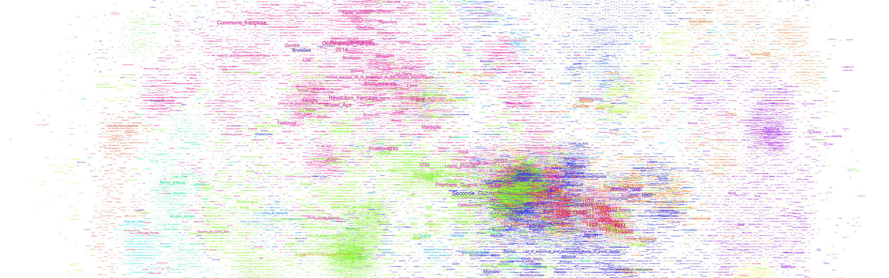
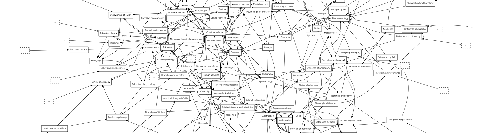
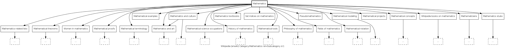

# ROOT DIRECTORY README

## **The Question**

This project started with a simple question: how many pages on wikipedia are related to mathematics? 

As it turns out, the answer is not so simple.

After searching with Mathematics category page, I found this line:

But after reaching out to the category page editors, I was told that the number was not updated since 2015, and that other numbers were floating around from around the same time that were estimating the number to be around 17,000 and 21,000. The editors quicly deleted the line.



## **The Problem**
Wikipedia's system of categorizing content is all over the place. 


#### _Wikipedia Methods of Categorizing:_

- [Portal page](https://en.wikipedia.org/wiki/Portal:Contents/Portals#Mathematics_and_logic)
- [Contents page](https://en.wikipedia.org/wiki/Portal:Contents/Mathematics_and_logic)
- [Category page](https://en.wikipedia.org/wiki/Category:Mathematics)
- [Outline page](https://en.wikipedia.org/wiki/Outline_of_mathematics)
- [Areas of Mathematics page](https://en.wikipedia.org/wiki/Areas_of_mathematics)
- [Indices](https://en.wikipedia.org/wiki/Category:Mathematics-related_lists)
- [Overviews](https://en.wikipedia.org/wiki/Category:Mathematics-related_lists)
- [Glossaries](https://en.wikipedia.org/wiki/Category:Mathematics-related_lists)

Of these, Mathematics is organized using subset of these structures:

- [Mathematics Portal page](https://en.wikipedia.org/wiki/Portal:Contents/Portals#Mathematics_and_logic)
- [Mathematics Contents page](https://en.wikipedia.org/wiki/Portal:Contents/Mathematics_and_logic)
- [Mathematics Category page](https://en.wikipedia.org/wiki/Category:Mathematics)
- [Mathematics Outline page](https://en.wikipedia.org/wiki/Outline_of_mathematics)
- [Areas of Mathematics page](https://en.wikipedia.org/wiki/Areas_of_mathematics)
- [Mathematics Lists](https://en.wikipedia.org/wiki/Category:Mathematics-related_lists)
- [lists of lists of lists](https://en.wikipedia.org/wiki/List_of_lists_of_lists#Mathematics_and_logic)

This also includes the [list of mathematics topics page](https://en.wikipedia.org/wiki/Lists_of_mathematics_topics)

Contents Overview Outlines Lists Portals Glossaries Categories Indices



#### _Wikidata Methods of Categorizing:_

Outside of the Wikipedia project, the WikiMedia Foundation also includes the the Wikidata project. This project is based on a graph database (using the Sparql language) that is community edited organize data based on their interconnections.

```sparql
 SELECT distinct ?item ?article ?sitelink ?linkTo WHERE {
       { ?item wdt:P361* wd:Q395 .}
       union
       { ?item wdt:P361/wdt:P279* wd:Q395 .}
       union
       { ?item wdt:P31/wdt:P279* wd:Q1936384 .}
       union
       { ?item wdt:P921/wdt:P279* wd:Q395 .}
       optional 
       { ?sitelink ^schema:name ?article .
         ?article schema:about ?item ;
         schema:isPartOf <https://en.wikipedia.org/> .
       }
       OPTIONAL { ?item wdt:P361 ?linkTo. }
       SERVICE wikibase:label { bd:serviceParam wikibase:language "en". }
       }
```
While graph databases are dope, when humans are used to create nodes and relationships the data is not entirely reliable.

#### _Wikipedia Vital Articles Page_
Addictionally, some Wikipedians a have been hand-selecting Wikipedia articles to be given the designation of a "Vital article." The page ["Wikipedia:Vital_articles"](https://en.wikipedia.org/wiki/Wikipedia:Vital_articles) includes a subcategory of [vital mathematics articles](https://en.wikipedia.org/wiki/Wikipedia:Vital_articles/Level/5/Mathematics). With stated goal of compiling 1,100 articles, its current count of only 489 articles reflects the difficulty faced with manually sorting articles into categories.

## **Data Wrangling**

### _Wikidata Search_

While the results from the Wikidata database search did not answer our original question, we can use the results to create a seed dataset.

While ~800 articles may be enough to train a Natural Language Processing model, more data is always better.

Even though the Wikidata query is complex and not likely something that an average wikimedia user is capable of writing, we will use this number as our evaluation metric. This metric represents the ability of wikimedia contributors to structure content around a major category.

### _Webscraping_

To accomplish this, we can turn to scraping Wikipedia category strucutures. For each category structure page, we can find all the internal wiki links, store them in a container. This represents a depth search of one. Next, scraping the pages in the container for more internal wiki links results in a depth search of two. The number of iterations we perform on the articles in our container will determine the depth of our search. This can result in a large set of links, however it is a bit crude since links can be arbitrarily added to a page.

While web scraping is fun, the Wikimedia Foundation has already developed a program for us that does this for us. It is called the [PetScan](https://petscan.wmflabs.org/).

https://en.wikipedia.org/wiki/Special:CategoryTree

### _Node Weighting_
The deeper we traverse each tree, we are more likely to find pages within the tree that are not highly correlated with our target category, or to provide noise into the machine learning model during training. Since we have tree depth data, we can give nodes close to the root a higher weighting than nodes farther away from the root. During the scraping process, we are keeping track of the depth while saving the node to a file.

ADD AN IMAGE OF TREES WITH A GRADIENT AWAY FROM ROOT

### _PetScan searching_

Contributors to the Wikimedia Foundation have built a tool for finding articles based on categories. It is a powerful tool, but it is too crude to answer our original question. Instead, we will use it to find our seed dataset. 

PetScan takes in a category parameter and a depth of search parameter. This roughly translates to the same process that we would have used if we were scarping Wikipedia ourselves.  

Searching the Mathematics category with a depth of one yields 1,216 results. Kinda disappointing. A depth search of two yields 11,393 results, and a depth search of three yiedls 34,013. Well, that escalates quickly. However, with larger depths, we are also getting more noise in the results. We'll pick a depth search of one, and supplement this set by also searching mathematics subtopics using Petscan. After searching the Algebra, Arithmetic, Calculus, Combinatorics, Game Theory, Geometry, Linear Algebra, Probability, Statistics, and Topology categories with a depth of one, respectively, we have a total of about 10,000 results to add to our Wikidata results. 

### _Putting it All Together_

After combining all of the articles we gathered, we can delete any duplicates and make a count of our bounty.

_Seed Dataset Count: 10,338_

If that was all we had to do, we'd be golden. But we want to be thorough and check that our seed dataset is purged of bad articles.

### _Manual Cleaning_

There is no way around it: each item in our seed dataset needs to be checked and purged if it is not related to mathematics, or is only tangentially related to mathematics. Common articles that were purged included people related to mathematics, articles about academic journals, and universities.

_Seed Dataset Count after Cleaning: 8,687_

_Hours of Manual Cleaning: 4.25_

## Noise Dataset

In order to train a model to teach it how to recognize mathematics articles, we need a dataset of non-mathematics articles. For this we will use Physics, Biology, Chemistry, and Computer Science articles. We will again use Petscan with a depth of one search.

Physics:

Biology:

Chemistry:

Computer Science:

## **Evaluation Metric**

As described above, the evaluation metric we will be using is 800 mathematics related articles. This metric was derived from a search of the Wikidata graph database for mathematics-related nodes with associated English wikipedia articles.

## **Lets See What We Can Do with Our Seed Dataset!**

## Traversing Wikipedia

['Wikipedia Data Science: Working with the World’s Largest Encyclopedia'](https://towardsdatascience.com/wikipedia-data-science-working-with-the-worlds-largest-encyclopedia-c08efbac5f5c)

Traversing XML tree iteratively:
xml.sax

parsing wikipedia content pages:
mwparserfromhell


4.3 Category hierarchy as isa graph

In many of the knowledge discovery tasks, Wikipedia category hierarchy is treated as an isa graph. Though it makes sense (in most of the cases) to treat the concept represented by a child category as a specific type of a broader concept represented by a parent category (e.g., Computer_science is a type of Applied_sciences), it is often the case that long distance isa relationship in category hierarchy does not make sense. For example, we can trace a path from the category “Optical_storage” to “Biology” as follows:

Optical_computer_storage is a descendant of Biology as per the following relation hierarchy: 

Optical_computer_storage → 
Computer_storage_devices → 
Recorders → 
Equipment → 
Technology → 
Intellectual_works → 
Creativity → 
Intelligence →
Neuroscience → 
Biology

Similarly, from “Automotive_testing_agencies” to “Algebra” as follows:
Automotive_testing_agencies is a descendant of Algebra as per the following relation hierarchy:

Automotive_testing_agencies → 
Automobiles → 
Private_transport → 
Transport → 
Industries → 
Economic_systems → 
Economics → 
Society → 
Structure → 
Dimension → 
Manifolds → 
Geometric_topology → 
Structures_on_manifolds → 
Algebraic_geometry → 
Abstract_algebra → 
Algebra

As explained in Section 3.1, our manual inspection of a few (39) randomly sampled documents show that, is-a relation does not make sense beyond 7 levels. We found that, between 3 to 5 levels, we can get a reasonably good isa relation.


Bairi R. B. & Carman M. & Ramakrishnan G. (2015). On the Evolution of Wikipedia: Dynamics of Categories and Articles. Papers from the 2015 ICWSM Workshop, pp. 9.