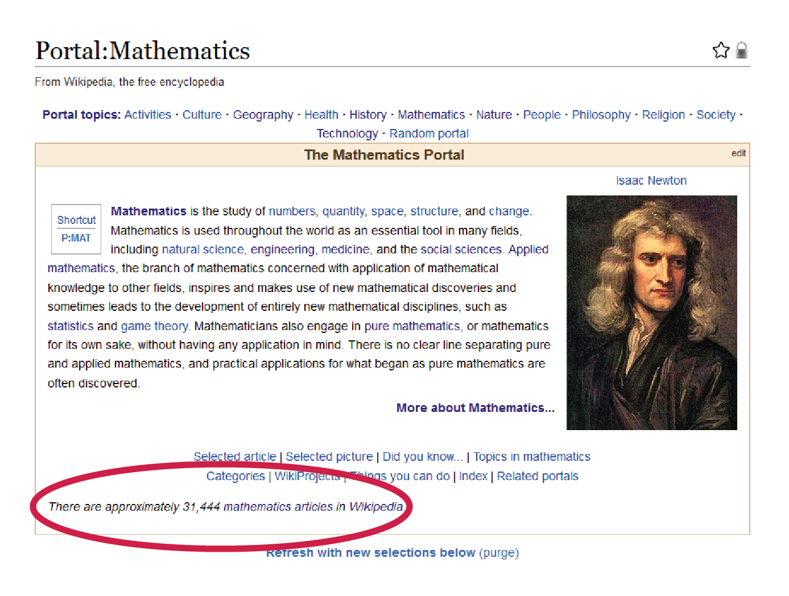
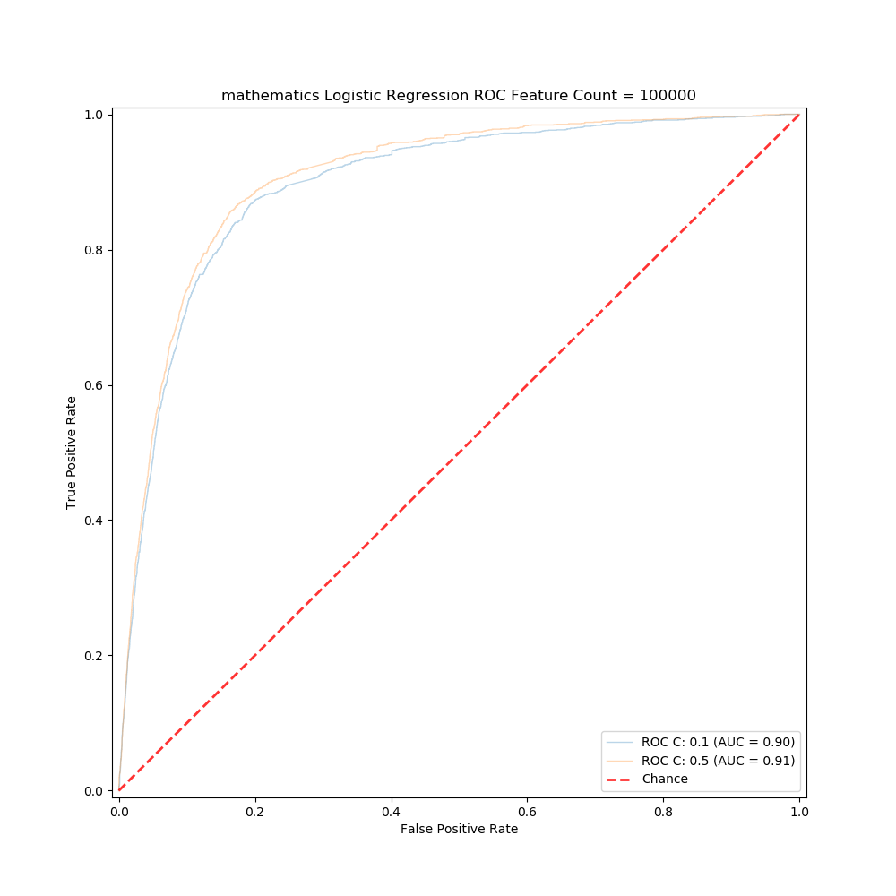

# **README.md**

### JAKUB SVEC

#### www.github.com/jakubsvec001

#### jakubsvec001@gmail.com

#### www.linkedin.com/jakubsvec001/

# **ROOT DIRECTORY**

## **Business Problem**
### _- Single-Source Truth on Wikipedia_

The method used to develop Wikipedia into the largest and most comprehensive encyclopedia in the world, and simultaneously the fifth most visited website in the world, is `based the way that readers consume articles and the way that editors collaborate on Wikipedia`. The most important thing readers and editors of Wikipedia share with one another is that they both interact with the website on level of individual articles. Most Wikipedia articles consumed or edited not by using Wikipedia's content curation system, but instead through Google or Bing searches. Very rarely do readers and editors engage with the inter-article relationships of topics. This article-level development allowed Wikipedia to grow quickly and produce high-quality articles and it may have been reasonable to hope that an emergent property of Wikipedia's would include a self-organizing, coherent categorization system. 

This has turned out to not be the case. For proof, see the following links to as sample of different categorization tools:

#### _Wikipedia Methods of Categorizing:_

- [Portal page](https://en.wikipedia.org/wiki/Portal:Contents/Portals#Mathematics_and_logic)
- [Contents page](https://en.wikipedia.org/wiki/Portal:Contents/Mathematics_and_logic)
- [Category page](https://en.wikipedia.org/wiki/Category:Mathematics)
- [Outline page](https://en.wikipedia.org/wiki/Outline_of_mathematics)
- [Areas of page](https://en.wikipedia.org/wiki/Areas_of_mathematics)
- [Indices](https://en.wikipedia.org/wiki/Category:Mathematics-related_lists)
- [Overviews](https://en.wikipedia.org/wiki/Category:Mathematics-related_lists)
- [Glossaries](https://en.wikipedia.org/wiki/Category:Mathematics-related_lists)
- [Contents/Lists](https://en.wikipedia.org/wiki/Portal:Contents/Lists)
- [Category: Lists](https://en.wikipedia.org/wiki/Category:Lists)
- [Category: Lists of Lists](https://en.wikipedia.org/wiki/Category:Lists_of_lists)
- [Lists of Lists of Lists](https://en.wikipedia.org/wiki/List_of_lists_of_lists)

and most notably:
- [wikidata.org](https://query.wikidata.org/)

Each of these tools is used differently from the others and editors seemingly arbitrarily prefer some methods over others. What this means is that there is `no single source of truth` for category-level queries on Wikipedia.

While Wikipedia does possess a category system, the lack of a coherent structure leads to a messy network of articles and makes the problem of finding properly formatted categories within the cluster of nodes and edges a challenge:

### _- Toy Example Question:_

An example of a toy problem that Wikipedia currently cannot answer is `how many articles on Wikipedia are related to mathematics`? While this may seem trivial, this indicates that Wikipedia truly does have a categorization problem.

- The [mathematics portal](https://en.wikipedia.org/wiki/Portal:Mathematics) provides one answer: __31,444__

- [Wikidata](https://query.wikidata.org/#SELECT%20distinct%20%3Fitem%20%3Farticle%20%3Fsitelink%20%3FlinkTo%20WHERE%20%7B%0A%20%20%20%20%20%20%20%7B%20%3Fitem%20wdt%3AP361%2a%20wd%3AQ395%20.%7D%0A%20%20%20%20%20%20%20union%0A%20%20%20%20%20%20%20%7B%20%3Fitem%20wdt%3AP361%2Fwdt%3AP279%2a%20wd%3AQ395%20.%7D%0A%20%20%20%20%20%20%20union%0A%20%20%20%20%20%20%20%7B%20%3Fitem%20wdt%3AP31%2Fwdt%3AP279%2a%20wd%3AQ1936384%20.%7D%0A%20%20%20%20%20%20%20union%0A%20%20%20%20%20%20%20%7B%20%3Fitem%20wdt%3AP921%2Fwdt%3AP279%2a%20wd%3AQ395%20.%7D%0A%20%20%20%20%20%20%20optional%20%0A%20%20%20%20%20%20%20%7B%20%3Fsitelink%20%5Eschema%3Aname%20%3Farticle%20.%0A%20%20%20%20%20%20%20%20%20%3Farticle%20schema%3Aabout%20%3Fitem%20%3B%0A%20%20%20%20%20%20%20%20%20schema%3AisPartOf%20%3Chttps%3A%2F%2Fen.wikipedia.org%2F%3E%20.%0A%20%20%20%20%20%20%20%7D%0A%20%20%20%20%20%20%20OPTIONAL%20%7B%20%3Fitem%20wdt%3AP361%20%3FlinkTo.%20%7D%0A%20%20%20%20%20%20%20SERVICE%20wikibase%3Alabel%20%7B%20bd%3AserviceParam%20wikibase%3Alanguage%20%22en%22.%20%7D%0A%20%20%20%20%20%20%20%7D) provides another answer: __23,051__

- [PetScan](https://petscan.wmflabs.org/) provides yet another answer:  __34,431__

Moreover, `documentation for these results` is not provided and therefore the `results are not reproducible`, and a remedy is needed.

## **Proposed Solution**
### _- Natural Language Processing and Machine Learning to the Rescue!_

To take a first stab at this problem, I used simple Natural Language Processing techniques and simple machine learning models to read the contents of preselected Wikipedia articles related to mathematics, convert the words in each article to numbers (vectors), and trained a machine learning model on those vector features. The idea is that the articles contain unique information that can be used to identify articles of predefined categories. 

For vectorization, I used TF-IDF:

For modeling, I explored Multinomial Naive Bayes:

and Logitic Regression with L2 regularization:

I then released my trained model on the entire Wikipedia corpus.

## **Results**

After creating a TF-IDF model using mathematics articles and using the entire training corpus to train a final Logistic Regession model, I set the model loose on the entire Wikipedia data dump.

Using 20% as the probability threshold for deciding whether a Wikipedia article is highly related to the category of mathematics, my model predicts that `about 230,000 articles on Wikipedia are highly related to the category of mathematics`.

## **Tools Used**
The tools used to train and deploy the machine learning model include:

1. [Wikipedia Data Dump](https://dumps.wikimedia.org/enwiki/latest/) (english-language articles only)
2. [Gensim](https://radimrehurek.com/gensim/)
3. [Scipy](https://www.scipy.org/)
4. [Scikit-Learn](https://scikit-learn.org/stable/)
5. [Multiprocessing](https://docs.python.org/2/library/multiprocessing.html)
6. [Regex](https://docs.python.org/3/library/re.html)

The `english-language Wikipedia Data Dump` was used instead of querying the Wikipedia server in order to be king to the Wikimedia organization, and to increase the speed of scanning articles.

The `Gensim` library was used to take advantage of its ability to generate vectorized models of text without the need to store the entire corpus in memory. Instead, models are generated iteratively article by article with only one article needing to be loaded onto RAM at a time. This helps with scaling to larger projects. While this project utilized only TF-IDF, Gensim can also be used to generate Word2Vec and Doc2Vec vectorizations with ease.

`Scipy` was used to convert Gensim objects into sparse matrices that can be used as input to Sklearn models.

`Scikit-Learn` was used for its Multinomial Naive Bayes and Logistic Regression models.

In order to efficiently search multiple data dump XML files, it became useful to spread the work across multiple jobs. For this, `Python's multiprocessing library` was used. 

The python library for `Regular Expressions` was heavily used to extract metadata from the page content of each article. More efficient regular expressions are needed to properly parse all page content on all articles, as articles cause current regular expressions result in catasrophic backtracking occurring. 

## **Data Understanding**
### _- Data scrapping the Wikipedia Category Tree_

To provide a dataset on which my models can learn, I scraped the [Wikipedia Category tree](https://en.wikipedia.org/wiki/Special:CategoryTree?target=mathematics&mode=all&namespaces=&title=Special%3ACategoryTree).

The `Category Tree` looks something like the following, where the following graph shows a tree of `depth one`:

Unfortunately, with a depth of greater than three, `the child categories begin to bleed` into different categories. Furthermore, there are documented cases in which `cycles` have been found in the Wikipedia Category Tree. 

__*Examples of paths that produce cycles:*__

*__Biology__ → Optical_computer_storage → Computer_storage_devices → Recorders → Equipment → Technology → Intellectual_works → Creativity → Intelligence → Neuroscience → __Biology__*

*__Algebra__ → Automotive_testing_agencies → Automobiles → Private_transport → Transport → Industries → Economic_systems → Economics → Society → Structure → Dimension → Manifolds → Geometric_topology → Structures_on_manifolds → Algebraic_geometry → Abstract_algebra → __Algebra__*

*[Reference: 'On the Evolution of Wikipedia', page 9](https://www.google.com/url?sa=t&rct=j&q=&esrc=s&source=web&cd=1&ved=2ahUKEwja6N-W-affAhVBiqwKHb9wA-cQFjAAegQIARAC&url=http%3A%2F%2Fusers.monash.edu.au%2F~mcarman%2Fpapers%2FBairi_ICWSM_workshop2015.pdf&usg=AOvVaw3sNrC6ftjkIX4s3PqTsqcs)*

Because the tree in more of a network than a [directed acyclical graph (DAG)](https://en.wikipedia.org/wiki/Directed_acyclic_graph), I chose to scrape three levels deep for each category. No further cleaning of the tree was performed. In the future, each category will be scrubbed using a `mechanical turk`.

To provide my model with data that is representative of the wide range of Wikipedia articles, I scraped the following categories:

- Mathematics
- Physics
- Biology
- Chemistry
- Engineering
- Arts
- Philosophy
- Computer Science

After scraping, the `total training set includes about 80,000` articles with `about 13K belonging to the category of mathematics`.

## **Data Preparation**

#### _Cleaning_

To prepare each article for vectorizing, the following was extracted from each page's XML data:

- Body of the article
- link text
- header text
- article title

This content was then contatenated into a single list of n-grams.

The following metadata was not used due to issues of catastrophic backgracking produced by regular expression searches:

- File metadata text
- Image metatdata text

The 'Category' tags in each article were deleted to avoid data leakage.

#### _Stop Words_

To eliminate frequently-used words that tend to carry little significant meaning, I deleted words such as "and," "the," and "a" from each article.

#### _Stemming_

I stemmed each word to its root. For example, the word "summing" is stemmed to the word "sum," and the word "algebraic" stems to "algebra." 

#### _N-grams_

To capture the meaning of words at a higher-level, I created n-grams of up to three. For example, the following sentence would produce the following n-gram list:

**Example Sentence =** _'I love spam but not ham'_

**N-grams =** _['I', 'love', 'spam', 'but', 'not', 'ham', 'I love', 'love spam', 'spam but', 'but not', 'not ham', 'I love spam', 'love spam but', 'spam but not', 'but not ham']_

## **Modelling and Evalutaion**
### _- How well does the model work?_

The final model utilizes TF-IDF and Logistic Regression. The dictionary used to produce the `TF-IDF model filters out extreme n-grams` that are present in more than 50% of the documents and that are present in fewer than 5% of the documents. If the total count of n-grams is below 100,000, the list of n-grams was shortened to the top 100,000 n-grams. 

The best `regularization hyperparameter (C)` for predicting the category of 'mathematics' was 8, indicating that the __$\lambda$__ of the regularizated log-loss function was low. Other categories, such as computer science, required a `C` of about 0.2, indicating that it required a higher __$\lambda$__ to reduce overfitting.

#### _ROC AUC_

With AUC score of about 92%, we can see that the model performs surpisingly well considering the models used are simple. This indicates that more advanced models should be investigated. The further tweaks, the proposed solution to Wikipedia's problem may be worth further development by the Wikimedia Foundation.

#### _FEATURE IMPORTANCE_

The following horizontal bar chart shows different words and their coefficients. The `green bars` represent the top five most important n-grams for determining whether an article is classified as a being within the category of mathematics. These are the highest coefficients. The `orange bars` represent the 10 most unimportant features with coefficiences closest to zero. The `blue bars` represent the five most important n-grams for determining if an article is not in the category of mathematics. These words possess the lowest coefficients.

Not very surprising, but it is what it is.

## **Conclusion**
The proposed solution merits further development.

## **Next Steps**

* Pre-clean / Mechanical Turk positive class datasets for more desireable classification
* Implement tools to populate article quality statistics
* Explore other vectorizing models (Word2Vec, Doc2Vec)
* Explore generalizability of model on to arXiv.org papers
* Train only on page metadata to explore tradeoff associated with classification speed increase and reduction in precision/recall

# JAKUB SVEC

## www.github.com/jakubsvec001

## jakubsvec001@gmail.com

## www.linkedin.com/jakubsvec001/